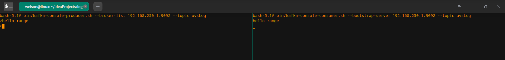

# Build dev 
- ES : 7.6.2
- Kafka : 2.11
- Zookeeper : 7.6.2

http://localhost:8080      
http://localhost:5601   
http://localhost:9100   
http://localhost:9200   

## 1 portainer
`docker run -d --privileged --restart always --name portainer -v /data:/data -v /var/run/docker.sock:/var/run/docker.sock -p 9000:9000 portainer/portainer`
[containers](http://localhost:9000/#/containers)

## 2 registry2
`docker run -d --restart always --name registry2 -v registry_data:/var/lib/registry -p 5000:5000 registry:2`

## 3 zookeeper
`docker pull wurstmeister/zookeeper
docker run -d --name zookeeper -p 2181:2181 -v /etc/localtime:/etc/localtime wurstmeister/zookeeper`

## 4 kafka
`
docker pull wurstmeister/kafka:2.11-0.11.0.3
docker run  -d --name kafka -p 9092:9092 -e KAFKA_BROKER_ID=0 -e KAFKA_ZOOKEEPER_CONNECT=192.168.250.1:2181 -e KAFKA_ADVERTISED_LISTENERS=PLAINTEXT://192.168.250.1:9092 -e KAFKA_LISTENERS=PLAINTEXT://0.0.0.0:9092 -t wurstmeister/kafka
`

### 4.1 topic
`
docker exec -it kafka /bin/bash
cd /opt/kafka_*
bin/kafka-topics.sh --create --zookeeper 192.168.250.1:2181 --replication-factor 1 --partitions 1 --topic bhlog
`
### 4.2 producer
`bin/kafka-console-producer.sh --broker-list 192.168.250.1:9092 --topic uvsLog`
### 4.3 consumer
`bin/kafka-console-consumer.sh --bootstrap-server 192.168.250.1:9092 --topic bhlog --from-beginning` 

## 5 mysql
`docker pull mysql`
### 5.1 set root passwd
`sudo docker run -p 3306:3306 --name mysql -e MYSQL_ROOT_PASSWORD=123456 -d mysql`
### 5.1 create database
```sql
CREATE DATABASE uvslog;
show DATABASES;
use uvslog;
```
[mysql](https://www.cnblogs.com/sablier/p/11605606.html)  

## 6 ES
### 6.1 elasticsearch
`docker run -d --name=elasticsearch -p 9200:9200 -p 9300:9300 -e “discovery.type=single-node” docker.elastic.co/elasticsearch/elasticsearch:7.6.2`
### 6.2 kibana
`docker run -d --name=kibana --link elasticsearch:elasticsearch -p 5601:5601 docker.elastic.co/kibana/kibana:7.6.2`
### 6.3 head
`docker pull mobz/elasticsearch-head:5
docker run -d --name es-head -p 9100:9100 mobz/elasticsearch-head:5
docker ps -a esContainerId
docker exec -it cid /bin/bash
cd ./config
vim elasticsearch.yml
# add
http.cors.enabled: true
http.cors.allow-origin: "*"
docker restart  elasticsearch

`
[head](http://localhost:9100/)

### 6.4 filebeat
docker run -d -v /var/tomcat/log/:/var/tomcat/log/ -v /var/vts/log/logs/vts/all/:/var/vts/log/logs/vts/all/ -v /var/log/nginx/:/var/log/nginx/ -v /opt/ebee_server/log/:/opt/ebee_server/log/ -v /opt/ebee_server/:/opt/ebee_server/ -v /opt/daping-service/:/opt/daping-service/ --name=filebeat --user=root docker.elastic.co/beats/filebeat:7.6.2 filebeat -e -strict.perms=false -E output.elasticsearch.hosts=[“192.168.0.124:9200”]
docker exec -it filebeat bash



[spring-kafka](https://spring.io/projects/spring-kafka) 
